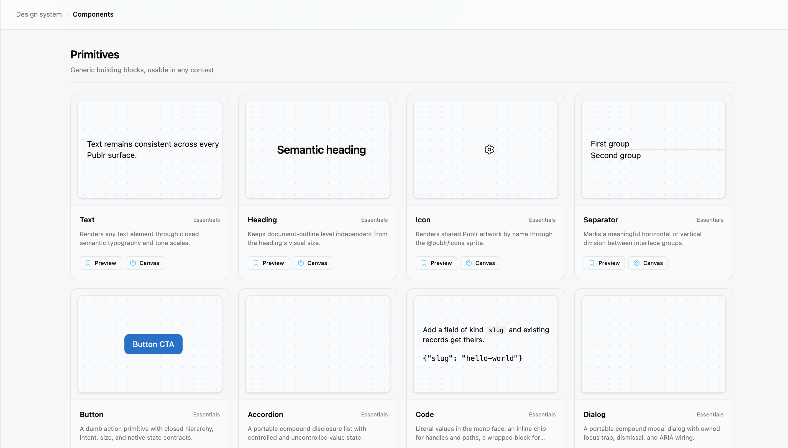

<div align="center">

# Publr UI

**The design system behind Publr. One PTSX source, rendered natively on the server and in the browser.**



</div>

---

Publr UI is a set of 55 components written in PTSX: TypeScript with JSX and
Publr directives. The same file is lowered to Zig for server-rendered pages and
to DOM for the browser, so the CMS admin, the site editor and a plain HTML page
all draw from one definition. There is no build output and no package to
install. A consumer points at this directory and compiles the components into
its own binary.

## Why

- **One source, two targets.** A component renders as static HTML from a Zig
  server and as live DOM in the browser, with the same appearance and the same
  interactions after activation. The gate refuses anything that only works on
  one side.
- **Props are types.** A component's TypeScript parameter type and its
  destructuring defaults are its whole contract. No runtime schema, no prop
  tables to keep in sync.
- **Closed looks.** Every visual choice is a named variant or prop. Consumers
  use the defaults and never restyle a component; a look they need is added
  here first, so every Publr surface stays one system.
- **Documented by example.** Each component ships a recipe: purpose, when to
  use it and when not to, rules, accessibility notes, prop docs and rendered
  variants. The recipe is the documentation and the demo in one.
- **No node on the path.** The gate is Zig. The compiler is Zig. The runtime is
  a few KB of JavaScript that hydrates what the server already rendered.

## Components

| Group | Components |
|---|---|
| Essentials | Accordion, AssetCard, Avatar, AvatarGroup, BulkActions, Button, Code, DataTable, Dialog, Drawer, Dropdown, Empty, Heading, Icon, PageHeader, PaneHeader, Pagination, SectionTitle, Select, Separator, Status, Table, Text, Timeline |
| Navigation | Breadcrumb, FilterBar, FilterChip, FolderNav, Link, Sidebar, TabNav |
| Forms | Checkbox, CheckboxField, ChoiceButton, ChoiceCard, Field, Input, InputGroup, MultiSelect, NativeSelect, Radio, RangePicker, RangeScalePicker, Switch, Textarea, UnitControl |
| Cards and callouts | Callout, LinkCard, ReferenceCard, PanelTab |
| Editor | BoxControl, BoxValueControl, StyleControl, SelectedCornersIcon, SelectedSidesIcon |

## Quick start

Add the repository beside your project and depend on it by path. The
[pjsx](https://github.com/publr-org/pjsx) compiler lowers the components for
your target:

```zig
// build.zig.zon
.dependencies = .{
    .pjsx = .{ .path = "../pjsx" },
},
```

```tsx
import { Button } from "../ui/src/components/Button/Button.ptsx";
import { Icon } from "../ui/src/components/Icon/Icon.ptsx";

<Button intent="destructive">Delete</Button>

<Button label="Settings" hierarchy="tertiary" size="sm">
  <Icon name="settings" />
</Button>
```

Resolve `publr-runtime` and the `publr/*` extension imports to the runtime
build you ship, [publrjs](https://github.com/publr-org/publrjs), and icons to
[icons](https://github.com/publr-org/icons). The CMS does both during its Zig
build.

Then run the gate:

```sh
zig build test
```

Every component parses into the compiler's IR and lowers through the DOM
target, the whole set lowers through the Zig target as one program, and every
recipe lowers to DOM.

## The gallery

```sh
zig build serve     # builds the gallery and serves it at http://127.0.0.1:8200
zig build gallery   # the static site alone, under zig-out/gallery
```

Every component page, rendered from its recipe: an overview, usage
guidelines, every variant in light and dark, a canvas to try props on, and the
API with the rendered markup. Each demo runs in its own frame, so components
that keep their state at module level stay independent. The build lowers the
components, the recipes and the gallery app to ES modules with the compiler,
ships the runtime and the jit engine as wasm beside them, and an import map
ties the pieces together. No bundler, no node: the classes a page uses are
compiled to CSS in the browser, and the dialogs, drawers and menus really open.

## Layout

```
src/components/<Name>/      the component: one module per directory, parts beside it
src/icons.ts                the icon adapter over ../icons
src/publr-runtime.ts        the one import point for the runtime, ../publr-js
gallery/components/<Name>/  the component's recipe: meta and variants
gallery/gallery-types.ts    the shape every recipe follows
gallery/app/                the gallery: views/ in PTSX, state/ and frames/ in TypeScript,
                            runtime/ with the browser face of `publr-jsx` and the CSS engine,
                            main.ts for the shell and preview.ts for a demo's own frame
scripts/check.zig           the gate
scripts/gallery_gen.zig     the gallery build
```

## Authoring

A module exports one component. `JSX.Element` types renderable children, and
`condition && <Element />` is a single rendering branch. Interactive attributes
are JSX expressions, including `hidden`, `inert`, values and ARIA state.

Imports are relative: another component by its `.ptsx` path, the runtime from
`../../publr-runtime`, icons from `../../icons`. Dialog and Drawer take
`trapFocus` from `publr/focus`; the owning effect returns its cleanup, so
closing the component releases the trap and restores focus.

Building blocks, not shells. Composites compose `Text`, `Heading` and `Link`
rather than styling raw text, and those three keep their variant maps
literally identical. Data-driven lists use [DataTable](docs/data-table.md):
PTSX renders the initial rows and filters, then the runtime loads JSON and
updates keyed regions.

To add a component:

1. Create `src/components/<Name>/<Name>.ptsx`.
2. Create `gallery/components/<Name>/<Name>.gallery.ptsx`, exporting `meta`
   and one variant per look.
3. `zig build test`.

## Part of Publr

| Repository | What it is |
|---|---|
| [publr](https://github.com/publr-org/publr) | the CMS, one binary |
| [pjsx](https://github.com/publr-org/pjsx) | the PTSX compiler: DOM and Zig targets |
| [publrjs](https://github.com/publr-org/publrjs) | the browser runtime behind the `data-p-*` wire |
| [icons](https://github.com/publr-org/icons) | the icon set and its generated adapters |
| [jit](https://github.com/publr-org/jit) | classes to CSS, at build time or in the browser |
| [lib](https://github.com/publr-org/lib) | the Zig libraries: sqlite, http, auth, deps |

## License

[Apache 2.0](LICENSE)
